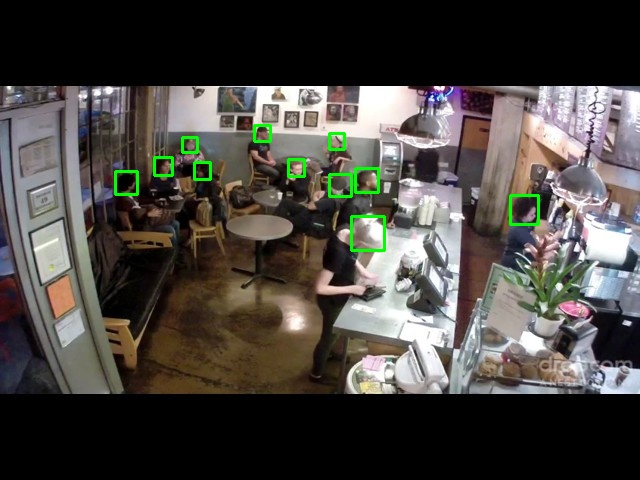
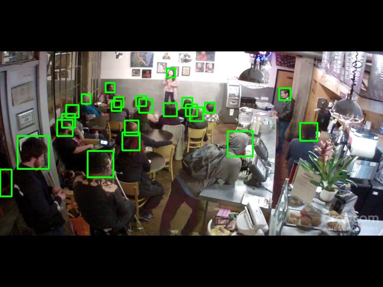
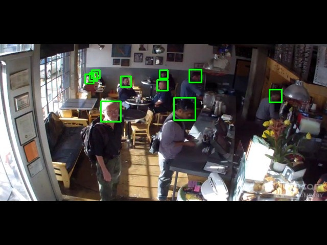
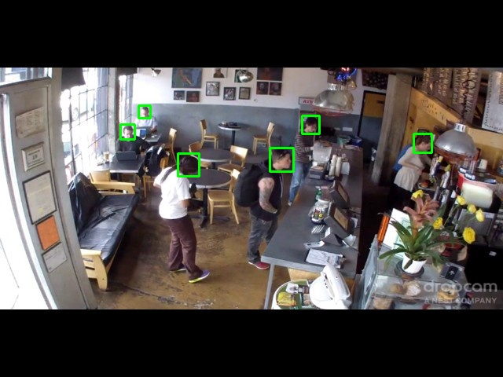

## Head Detection
We use the brainwash dataset introduced by paper [End-to-end people detection in crowded scenes](https://arxiv.org/abs/1506.04878).

### Recent Update
* `2019.09.23` model v1 for brainwash dataset is released.
* `2019.09.26` brainwash dataset (and packed pkl) is uploaded for downloading.

### Brief Introduction to Model Version
* v1 - is designed for brainwash dataset, covering head scale [10, 160]. It has 4 branches. Please check 
`./symbol_farm/symbol_structures.xlsx` for details.

### Inference Latency

* Platform info: NVIDIA RTX 2080TI, CUDA 10.0, CUDNN 7.4.2, TensorRT 5.1.5.0

Model Version|320×240|640×480|1280×720|1920×1080|3840×2160|7680×4320
-------------|-------|-------|--------|---------|---------|---------
v1|0.83ms(1198.38FPS)|1.91ms(524.14FPS)|4.83ms(206.92FPS)|10.62ms(94.19FPS)|42.28ms(23.65FPS)|166.81ms(5.99FPS)

* Platform info: NVIDIA GTX 1060(laptop), CUDA 10.0, CUDNN 7.4.2, TensorRT 5.1.5.0

Model Version|320×240|640×480|1280×720|1920×1080|3840×2160
-------------|-------|-------|--------|---------|---------
v1|1.62ms(618.53FPS)|4.83ms(207.06FPS)|13.67ms(73.18FPS)|30.01ms(33.32FPS)|121.15ms(8.25FPS)

> CAUTION: The latency may vary even in the same setting.

### Accuracy on Brainwash Dataset
We train v1 on the training set (10769 images with 81975 annotated heads) and evaluate on the test set (500 images with 5007 
annotated heads). This dataset is relatively simple due to monotonous scenario.

#### Quantitative Results on Test Set
Average Precision (AP) is used for measuring the accuracy. In detail, we use code [Object-Detection-Metrics](https://github.com/rafaelpadilla/Object-Detection-Metrics)
for calculating the AP metric. The following table presents the results:

Method|AP
--------|------
ReInspect, Lhungarian [1]|0.78
FCHD [2]|0.70
v1 (our)|0.91

>[1] [End-to-end people detection in crowded scenes](https://arxiv.org/abs/1506.04878)
>
>[2] [FCHD: Fast and accurate head detection in crowded scenes](https://arxiv.org/abs/1809.08766)

The v1 significantly outperforms the existing methods.

#### Some Qualitative Results on Test Set

### User Instructions
Please refer to [README in face_detection](../face_detection/README.md) for details.

### Data Download
We provide original and packed data of brainwash dataset. We provide three ways to download the packed data:
* [Baidu Yunpan](https://pan.baidu.com/s/1VdiXHhtw9aNaU1E9PhVwtQ) (pwd:zvma)
* [MS OneDrive]
* [Google Drive]