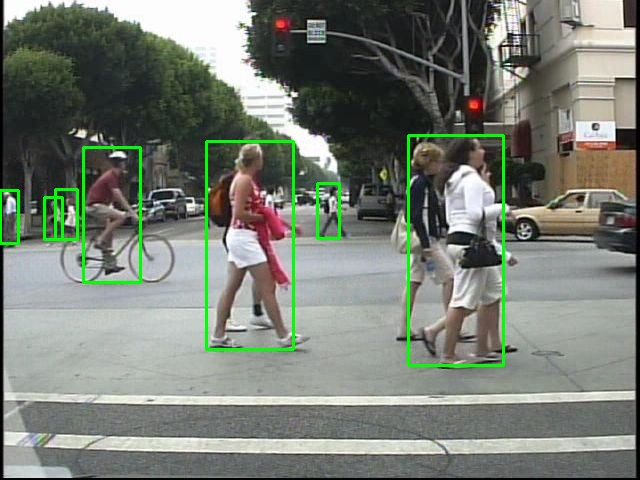
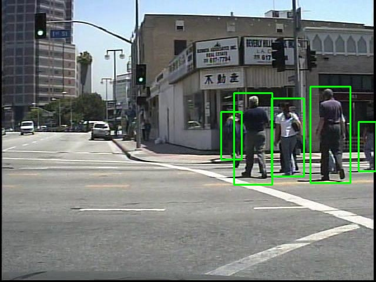
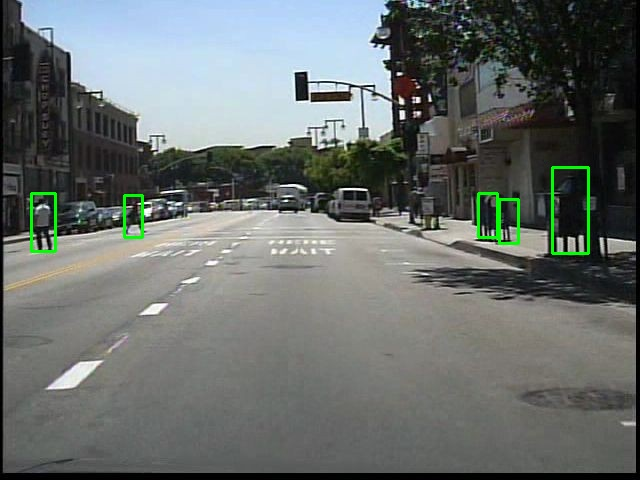
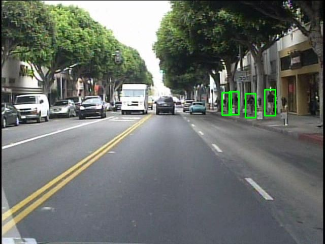

## Pedestrian Detection
We plan to use [Caltech Pedestrian Dataset](http://www.vision.caltech.edu/Image_Datasets/CaltechPedestrians/index.html)
with [new annotations](http://www.vision.caltech.edu/Image_Datasets/CaltechPedestrians/index.html),
[CityPersons](https://bitbucket.org/shanshanzhang/citypersons) (a part of [CityScapes](https://www.cityscapes-dataset.com/)) and 
[KITTI](http://www.cvlibs.net/datasets/kitti/eval_object.php?obj_benchmark=2d) for benchmarking.

### Recent Update
* `2019.09.18` preview version of model v1 for Caltech Pedestrian Dataset is released.

### Brief Introduction to Model Version
* v1 - is designed for Caltech Pedestrian Dataset, covering pedestrian scale [30, 320]. It has 4 branches. Please check 
`./symbol_farm/symbol_structures.xlsx` for details.

### Inference Latency
* Platform info: NVIDIA Jetson NANO, CUDA 10.0, CUDNN 7.5.0, TensorRT 5.1.6

Model Version|160×140|320×240|640×480|1280×720
-------------|-------|-------|-------|--------
v1|6.90ms(144.83FPS)|11.87ms(84.24FPS)|36.95ms(27.06FPS)|106.23ms(9.41FPS)
v2|-|-|-|-

* Platform info: NVIDIA Jetson TX2, CUDA 10.0, CUDNN 7.5.0, TensorRT 5.1.6 (power mode: MAXN)

Model Version|160×140|320×240|640×480|1280×720|1920×1080
-------------|-------|-------|-------|--------|---------
v1|3.63ms(275.43FPS)|6.80ms(147.36FPS)|15.87ms(63.01FPS)|43.33ms(23.08FPS)|93.93ms(10.65FPS)
v2|-|-|-|-|-

* Platform info: NVIDIA RTX 2080TI, CUDA 10.0, CUDNN 7.4.2, TensorRT 5.1.5.0

Model Version|320×240|640×480|1280×720|1920×1080|3840×2160|7680×4320
-------------|-------|-------|--------|---------|---------|---------
v1|1.01ms(985.71FPS)|1.55ms(644.93FPS)|3.26ms(306.77FPS)|6.50ms(153.76FPS)|24.58ms(40.68FPS)|99.71ms(10.03FPS)
v2|-|-|-|-|-|-

* Platform info: NVIDIA GTX 1060(laptop), CUDA 10.0, CUDNN 7.4.2, TensorRT 5.1.5.0

Model Version|320×240|640×480|1280×720|1920×1080|3840×2160
-------------|-------|-------|--------|---------|---------
v1|1.25ms(800.00FPS)|2.93ms(341.80FPS)|7.46ms(134.08FPS)|16.03ms(62.39FPS)|62.80ms(15.92FPS)
v2|-|-|-|-|-

> CAUTION: The latency may vary even in the same setting.

### Accuracy on Caltech Pedestrian Dataset
After investigating the data, we found that Caltech Pedestrian Dataset is not well annotated, even giving the
new annotations (not annotated, not aligned well, the highly occluded are annotated). The final data used for training: 
1559 pos images (at least one pedestrian inside), 2691 neg images; 4786 pedestrian in total; the longer side of bboxes
varies from 10 pixels to 500 pixels. 

Download links for packed training and test sets:
* [Baidu Yunpan](https://pan.baidu.com/s/1SvoSeg5thFHDDwZc9gh09A) (pwd:8omv)
* [MS OneDrive](https://1drv.ms/u/s!Av9h0YMgxdaSinO2G1DT-yPWkKc6?e=elsea6)
* [Google Drive](https://drive.google.com/open?id=1ICNAEfLa2YHJvxE6_YZYAA8Cyl1N1kAD)

#### Quantitative Results on Test Set
Currently, the quantitative results are not prepared well. We will release later.

#### Some Qualitative Results on Test Set
**(we found that false positives are often appear in the small scales, probably due to noisy training instances. For large scales, v1 performs well.)**

> To play with the trained v1 model, please check `./accuracy_evaluation/predict.py`.
### User Instructions
Please refer to [README in face_detection](../face_detection/README.md) for details.